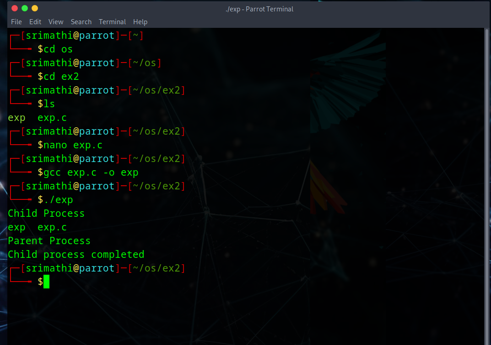

# Linux-Process-API-fork-wait-exec-
Ex02-Linux Process API-fork(), wait(), exec()
# Ex02-OS-Linux-Process API - fork(), wait(), exec()
Operating systems Lab exercise


# AIM:
To write C Program that uses Linux Process API - fork(), wait(), exec()

# DESIGN STEPS:

### Step 1:

Navigate to any Linux environment installed on the system or installed inside a virtual environment like virtual box/vmware or online linux JSLinux (https://bellard.org/jslinux/vm.html?url=alpine-x86.cfg&mem=192) or docker.

### Step 2:

Write the C Program using Linux Process API - fork(), wait(), exec()

### Step 3:

Test the C Program for the desired output. 

# PROGRAM:

## C Program to create new process using Linux API system calls fork() and getpid() , getppid() and to print process ID and parent Process ID using Linux API system calls
```
#include <stdio.h> 
#include <unistd.h>
int main() 
{ 
pid_t pid;
pid = fork();
if(pid == 0)
{
    // Child Process
    printf("Child Process ID : %d\n", getpid());
    printf("Parent Process ID : %d\n", getppid());
}
else
{
    // Parent Process
    printf("Parent Process ID : %d\n", getpid());
    printf("Parent's Parent Process ID : %d\n", getppid());
}

return 0;
}
```
## OUTPUT


## C Program to execute Linux system commands using Linux API system calls exec() , exit() , wait() family
```
#include <stdio.h>
#include <stdlib.h> 
#include <unistd.h>
#include <sys/wait.h>
int main() 
{ 
int pid;
pid = fork();   // create child process

if(pid == 0)
{
    // Child process
    printf("Child Process\n");

    // execute Linux command: ls
    execlp("ls", "ls", NULL);

    // if exec fails
    printf("Execution Failed\n");
    exit(1);
}
else if(pid > 0)
{
    // Parent process
    wait(NULL);

    printf("Parent Process\n");
    printf("Child process completed\n");
}
else
{
    printf("Fork Failed\n");
}

return 0;
}

```
## OUTPUT



# RESULT:
The programs are executed successfully.
